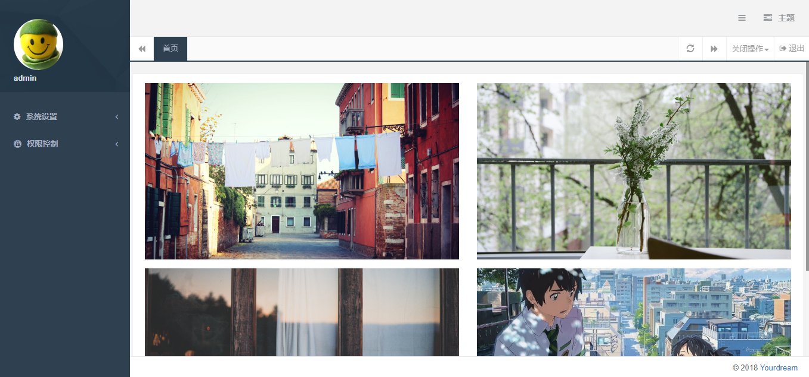
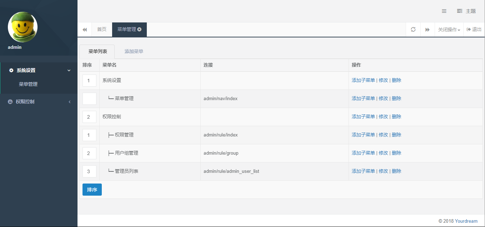
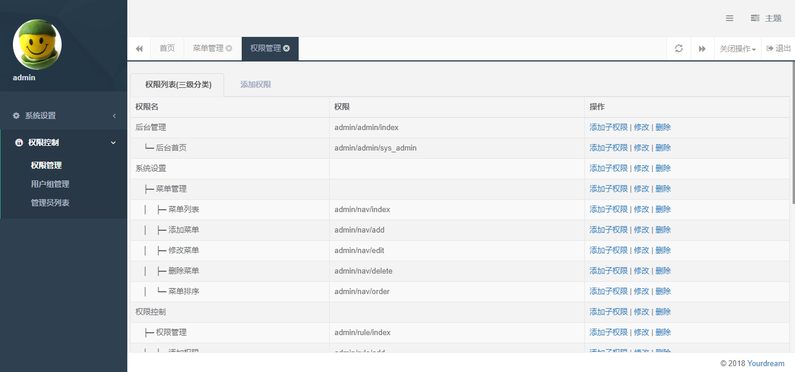
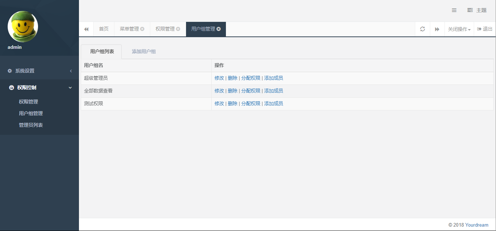
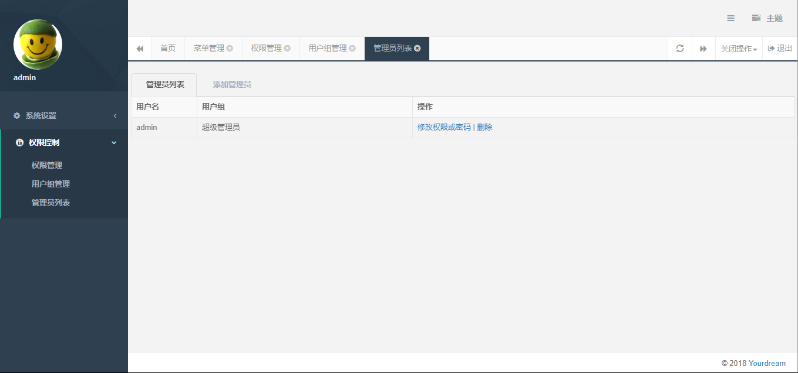

# 简单的后台管理系统

host文件添加本地域名

127.0.0.1 dev.admin.com

域名访问:http://dev.admin.com/index.php/admin/login/index

### 优化:
1. [增加]删除用户功能，admin用户不可删除，删除用户时，对应用户组也一起删除
2. [增加]查看用户组下面有哪些成员，并可删除成员，admin成员不可删除
3. [删除]不可删除超级管理员，用户组名称不可相同，删除用户组时，和用户对应关系也要删除
4. 添加权限时，默认给超级管理员增加权限
5. 超级管理员，名字和ID固定
6. 修改权限或密码时，显示已存在信息，密码不显示
7. 修改密码，需要2次确认，保证一致才能修改
8. 管理员名称不可相同

### 框架设计
1. H+, CI3.1.2
2. 仿造baijunyao.com的后台系统
3. 基于auth的权限设计
4. 仿造tp跳转方式

